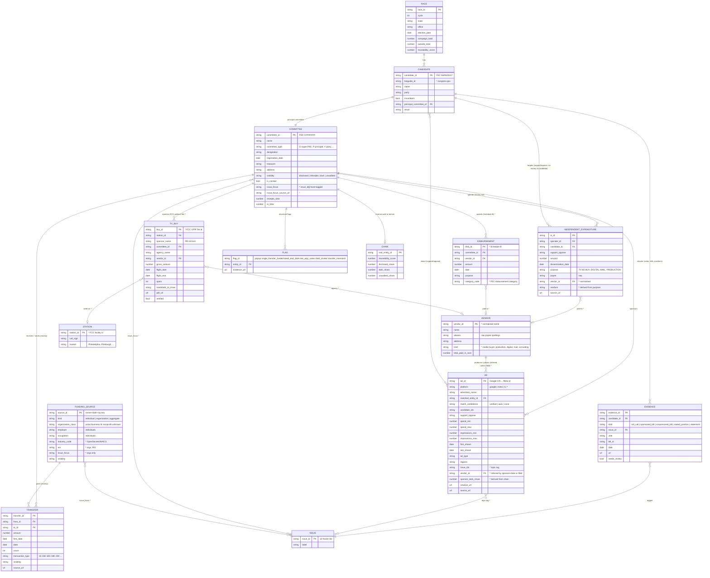

# Ontology — questions, data model, sources

Draft from the 2026-09-05 whiteboard. Not final; edit freely. Three parts: the questions the product must answer and
which surface answers them today; the ER diagram of the data model (what exists, what's proposed); and per-entity field
tables with where each field comes from or could come from. Status legend: **have** (real data on `main`), **partial**,
**missing**. Source legend: *(A)* actual, in the pipeline today; *(C)* candidate, checked to exist; *(?)* speculative.

## 1. Questions × surfaces

| # | Question (whiteboard) | Surface today | Status | Gap → what closes it |
| --- | --- | --- | --- | --- |
| Q1 | Who are the major funders of this race? | Ledger spenders table; chain termini; donor pages | have | — |
| Q2 | What is each funder's stance (single policy / multi)? | none | missing | `issue_focus[]` on committees + named org funders, hand-tagged from the org's own materials + IE targets + lobbying filings. Top-20 spenders ≈ 90% of dollars. |
| Q3 | What are the candidates' stances? | Dossier (votes, bills, stated positions on 10 issues) | have | McCormick side is thin (stated positions only); stated on page. |
| Q4 | How do they align with mine? | none | missing | Client-side 10-issue quiz → per-candidate "stated position matches / differs / no record". Static, no server. Language: "aligned with", never "endorsed". |
| Q5 | What % of the money is untraceable? | Ledger traceability card; per spender; per chain | have | Preliminary; `unwalked` separated from `dark`. |
| Q6 | What % of money is associated with specific goals/policies? | none | missing | Needs Q2's tags, then group outside $ by `issue_focus`. Shown as "spenders who describe themselves as focused on X account for $Y", never "$Y was spent on X". |
| Q7 | Per goal/policy, what % is traceable? | none | missing | Same tags × traceability, weighted by $. |
| Q8 | What media has been paid for? | Ad gallery (500 Google ads, spend/impression ranges) | partial | Vendor rows from Schedule E payees (TV/digital/mail by `purpose`); FCC political files for TV buys; Meta Ad Library. |
| Q9 | What % of media is candidate vs PAC? | none | missing | Campaign Schedule B media lines (not ingested) vs Schedule E media payees (have rows, not surfaced). |
| Q10 | Which ads are predominantly sponsored by dark money? | Ad card → sponsor → chain (3 clicks) | partial | Put sponsor's `dark` share on the ad card; media wall sortable by it. |
| Q11 | Race list + search | Home race table (1 real, 1 stub) | partial | Search over races/entities/candidates (static index, client-side). |
| Q12 | Funding chart A vs B (pie) | Candidate panels (bars) | have | Pie is a rendering choice; data is there. |
| Q13 | Interactive graph / ontology | Chain page (client-side pruned Sankey, expand nodes) | partial | Extend rightward: spender → vendor → ad → candidate. Today it stops at the spender. |
| Q14 | End-to-end: funder → PAC → vendor → ad → candidate | pieces | missing link | Vendor node + vendor→ad link (see §3 Vendor). |

## 2. ER diagram

Solid = money edge (dollars move). Targeting, production and tagging edges carry no dollars to the target and are never
drawn as money. `*` marks proposed entities/fields not yet in `contracts/`.

## 3. Entities, fields, sources

### Race, Candidate — have
| Field | Status | Source |
| --- | --- | --- |
| ids, party, incumbent, principal committee | have | FEC `cn`/`ccl` bulk *(A)* |
| result | have (hand) | state election results; MIT Election Lab *(C)* |
| bioguide_id | missing | congress.gov member API *(C)* — joins votes/bills cleanly |
| campaign totals | have | OpenFEC candidate totals *(A)* |

### Committee — have; `issue_focus` missing
| Field | Status | Source |
| --- | --- | --- |
| master fields (type, designation, treasurer, address, registration) | have | FEC `cm` bulk *(A)* |
| receipts (Schedule A itemised), transfers in/out | have | FEC `indiv`, `oth`, `pas2` bulk *(A)* |
| independent expenditures | have | OpenFEC `schedule_e` *(A)* |
| visibility, flags, chain, traceability | have | derived *(A)* |
| `issue_focus[]` + source | missing | hand-tag from the committee's website/mission (Wayback for defunct), FEC statement of organization, its IE targets across races, Senate LDA lobbying filings if affiliated org lobbies *(C)*; OpenSecrets "outside spending by ideology/single-issue" classification *(C, license check)* |
| disbursements (Schedule B) | missing | FEC `oppexp` bulk (operating expenditures, has category codes) *(C)*; OpenFEC `schedule_b` *(C)* |

### Funding source (chain terminus) — have; industry/stance missing
| Field | Status | Source |
| --- | --- | --- |
| name, employer, occupation, city/state/zip, amount | have | FEC `indiv` *(A)* |
| organization_class | have | name heuristics + FEC committee match *(A)* |
| industry_code | missing | OpenSecrets donor industry coding (bulk, requires agreement) *(C)*; NAICS via employer name match *(?)* |
| ein / 990 for nonprofits (c4 dark walls) | missing | ProPublica Nonprofit Explorer API (990s, officers, revenue; Schedule B donors are redacted) *(C)*; IRS 527 Form 8872 for political orgs *(C)* |
| LLC ownership | missing | state corporate registries / OpenCorporates *(C, patchy)* — this is the real dark wall |
| `issue_focus` (orgs only) | missing | same as committee |

### Transfer, Independent expenditure — have; vendor link missing
| Field | Status | Source |
| --- | --- | --- |
| all transfer fields, aggregation, dedupe | have | FEC bulk *(A)* |
| IE amount, target, purpose, payee, date | have (rows ingested, payee not surfaced) | OpenFEC `schedule_e` *(A)* |
| `vendor_id`, `medium` | missing | normalise `payee`; classify `purpose` by keyword (TV/CABLE/BROADCAST → tv, DIGITAL/ONLINE → digital, MAIL/POSTAGE → mail, PRODUCTION) *(derived)* |

### Vendor — missing (proposed)
| Field | Status | Source |
| --- | --- | --- |
| name, aliases, address | missing | Schedule E `payee_*` fields *(A, rows exist)*; Schedule B payee fields *(C)* |
| kind | missing | purpose keywords + hand list for the top ~20 (Waterfront Strategies, GMMB, Targeted Victory, Main Street Media, Smart Media Group…) |
| vendor → ad link | missing | **No filing links a buy to a creative.** Options: (a) FCC PB-18 names sponsor + agency + flight dates → join to TV; (b) for digital, sponsor + date-window overlap with Google/Meta run dates → label *"aired during these buys"*, never "this buy = this ad"; (c) Google Ads Transparency sometimes lists the agency on the advertiser page *(?)* |

### Ad — have (Google); topic, dark share, TV, Meta missing
| Field | Status | Source |
| --- | --- | --- |
| Google fields (advertiser, spend/impression ranges, dates, type, regions, creative) | have | Google Political Ads bulk (BigQuery public dataset / CSV bundle) *(A)* |
| advertiser → committee | have (5 verified, rest auto) | Google advertiser legal name ↔ FEC `cm` name *(A)* |
| Meta ads | missing | Meta Ad Library API (needs app + ID verification; has `bylines` = actual paid-for-by disclaimer, spend/impression ranges, demographics, regions) *(C)* — the only platform that exposes the paid-for-by line |
| `issue_ids` topic tag | missing | hand-tag top ads; keyword rules on ad text/transcript for the rest *(derived)*; Google dataset has no text for video — would need YouTube captions *(?)* |
| `sponsor_dark_share` | missing | derived from sponsor's chain *(A, one join)* |
| TV creatives | missing | no public archive with rights; AdImpact/Kantar are commercial *(?)*; Internet Archive TV News Archive has some political ad captures *(?)* |

### TV buy, Station — missing (proposed)
| Field | Status | Source |
| --- | --- | --- |
| political file PDFs per station | missing | FCC OPIF: `https://publicfiles.fcc.gov/api/` lists files; content is PDF (NAB PB-18: sponsor, agency, dates, spots, gross $, candidate/issue) *(C)*; extraction is OCR or by hand — plan: 6–8 Philadelphia/Pittsburgh stations × top 5 spenders, ~50 orders hand-entered, PDF as `source_url` |
| station master | missing | FCC facility database (call sign, market, licensee) *(C)* |
| market-level spend estimates | missing | AdImpact / Kantar CMAG *(commercial, ?)* |

### Evidence (dossier), Issue — have
| Field | Status | Source |
| --- | --- | --- |
| roll calls | have | senate.gov roll-call XML *(A)*; house.gov clerk XML for House races *(C)* |
| sponsored / cosponsored bills | have | congress.gov API *(A)* |
| stated positions | have (hand) | campaign site via Wayback *(A)*; Vote Smart Political Courage Test *(C)*; Ballotpedia candidate survey *(C)* |
| statements / press | missing | senate.gov press releases, C-SPAN transcripts *(?)* |
| issue tag | have (hand) | frozen taxonomy *(A)*; congress.gov policy-area field can seed *(C)* |

### Beyond one race (Q11 search, second race)
| Need | Source |
| --- | --- |
| all 2024 federal races | same FEC bulk; pipeline is race-parameterised; Schedule E per candidate via OpenFEC *(A)* |
| state races | FollowTheMoney (NIMSP) API *(C)*; state disclosure portals *(C, heterogeneous)* |
| 2026 live race | OpenFEC with `cycle=2026`, weekly refresh *(C)*; Google/Meta libraries update daily *(C)* |

## 4. Edge semantics (unchanged rules)

- **Money edges**: transfer, contribution, disbursement, IE payment to vendor, TV buy. Dollars conserve.
- **Targeting edges**: IE → candidate, ad → candidate, TV buy → candidate. Dashed; no dollars reach the candidate.
- **Production/placement edges**: vendor → ad. Inferred unless a filing names both; labelled as such.
- **Tag edges**: → issue. Hand-applied or rule-derived; carry `source_url` and `needs_review`.
- Stances on funders/PACs are *self-described focus*, sourced to the org's own material. Never derived from where the
  money went, and never phrased as buying a position.
